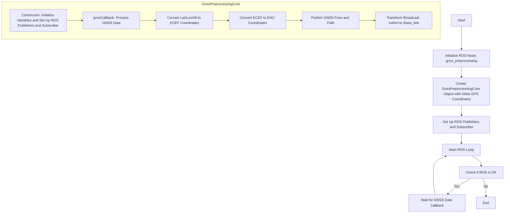
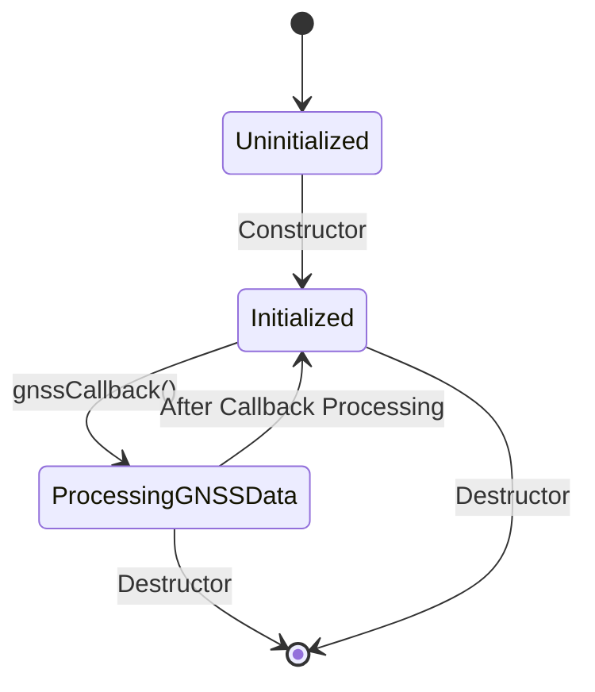

# gnss_preprocessing


# Algorithm

## ECEF Coordinates

The Cartesian coordinates with the Earth's center as the origin are called ECEF (Earth-Centered, Earth-Fixed) coordinates. The conversion formula can be written in a programming language style as follows:

- `Lat`: Latitude
- `Lon`: Longitude
- `High`: Altitude (elevation)
- `N`: Geoid height
- `PI`: Pi (π)
- `Xe`, `Ye`, `Ze`: ECEF coordinates

```plaintext
f = 1 / 298.257223563;
a = 6378137;
e = sqrt(f * (2 - f));
R = a / sqrt(1 - e^2 * sin(Lat * PI / 180)^2);
Xe = (R + High + N) * cos(Lat * PI / 180) * cos(Lon * PI / 180);
Ye = (R + High + N) * cos(Lat * PI / 180) * sin(Lon * PI / 180);
Ze = (R * (1 - e^2) + High + N) * sin(Lat * PI / 180);
```

## ENU Coordinates (Local Tangent Plane Coordinates)

Local tangent plane coordinates are called ENU coordinates. "E" stands for East, "N" for North, and "U" for Up. To convert latitude and longitude to ENU, you also need to use the ECEF conversion. Additionally, for ENU, you need to decide in advance where the origin of the Earth's plane is and keep it in ECEF coordinates. The conversion formula can be written in a programming language style as follows:

- `Xe`, `Ye`, `Ze`: ECEF coordinates of the point you want to convert
- `x0`, `y0`, `z0`: ECEF coordinates of the point you want to set as the origin of the local tangent plane
- `Lat`, `Lon`: Latitude and longitude of the point you want to convert

```plaintext
E = -sin(Lon * PI / 180) * (Xe - x0) + cos(Lon * PI / 180) * (Ye - y0);
N = -sin(Lat * PI / 180) * cos(Lon * PI / 180) * (Xe - x0) - sin(Lat * PI / 180) * sin(Lon * PI / 180) * (Ye - y0) + cos(Lat * PI / 180) * (Ze - z0);
U = cos(Lat * PI / 180) * cos(Lon * PI / 180) * (Xe - x0) + cos(Lat) * sin(Lon * PI / 180) * (Ye - y0) + sin(Lat * PI / 180) * (Ze - z0);
```

https://memo--randum.blogspot.com/2010/06/gps.html

## FlowChart



## State Transition Diagram


