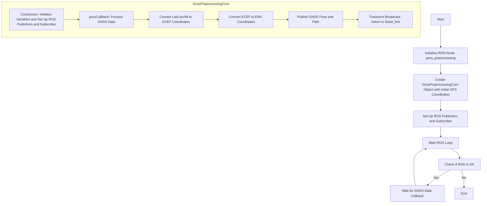

# gnss_preprocessing

## FlowChart



## UML

```mermaid
classDiagram
    class GnssPreprocessingCore {
        +double pi
        +double a
        +double ONE_F
        +double E2
        -ros::NodeHandle nh
        -double lat0
        -double lon0
        -double hig0
        -ros::Publisher gnss_pose_pub
        -ros::Publisher gnss_path_pub
        -nav_msgs::Path gnss_path
        -ros::Subscriber gnss_sub
        -tf::TransformBroadcaster odom_to_baselink_broadcaster
        -geometry_msgs::TransformStamped odom_to_baselink_trans
        +GnssPreprocessingCore(double, double, double)
        -~GnssPreprocessingCore()
        -void gnssCallback(const sensor_msgs::NavSatFixConstPtr&)
        -double deg2rad(double)
        -double rad2deg(double)
        -Eigen::Vector3d blh2ecef(double, double, double)
        -Eigen::Vector3d ecef2blh(double, double, double)
        -Eigen::Vector3d ecef2enu(Eigen::Vector3d, Eigen::Vector3d)
        -Eigen::Matrix3d rotx(double)
        -Eigen::Matrix3d roty(double)
        -Eigen::Matrix3d rotz(double)
        -int blh2enu(double, double, double, double, double*, double*)
        -double constrain(double, double, double)
    }

    GnssPreprocessingCore --|> ros::NodeHandle: Uses
    GnssPreprocessingCore --|> ros::Publisher: Uses
    GnssPreprocessingCore --|> nav_msgs::Path: Uses
    GnssPreprocessingCore --|> ros::Subscriber: Uses
    GnssPreprocessingCore --|> tf::TransformBroadcaster: Uses
    GnssPreprocessingCore --|> geometry_msgs::TransformStamped: Uses
    GnssPreprocessingCore --|> Eigen: Uses
    GnssPreprocessingCore --|> sensor_msgs::NavSatFixConstPtr: Uses
```
