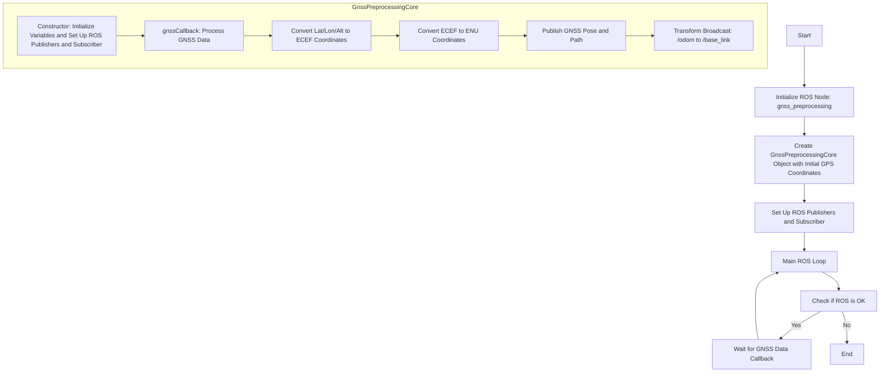
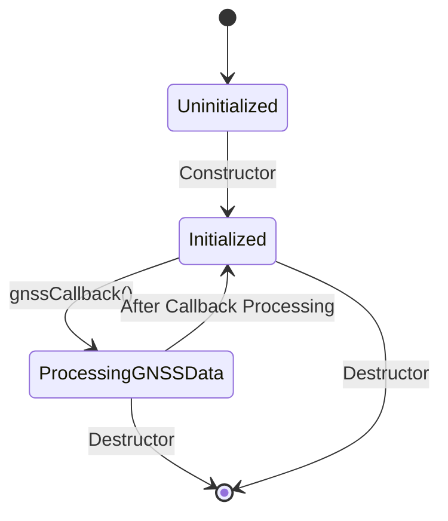

<script type="text/javascript" async src="https://cdnjs.cloudflare.com/ajax/libs/mathjax/2.7.7/MathJax.js?config=TeX-MML-AM_CHTML">
</script>
<script type="text/x-mathjax-config">
 MathJax.Hub.Config({
 tex2jax: {
 inlineMath: [['$', '$'] ],
 displayMath: [ ['$$','$$'], ["\\[","\\]"] ]
 }
 });
</script>

# gnss_preprocessing


# Algorithm

## ECEF Coordinates

The Cartesian coordinates with the Earth's center as the origin are called ECEF (Earth-Centered, Earth-Fixed) coordinates. The conversion formula can be written in a programming language style as follows:

- `Lat`: Latitude
- `Lon`: Longitude
- `High`: Altitude (elevation)
- `N`: Geoid height
- `PI`: Pi (π)
- `Xe`, `Ye`, `Ze`: ECEF coordinates

```plaintext
f = 1 / 298.257223563;
a = 6378137;
e = sqrt(f * (2 - f));
R = a / sqrt(1 - e^2 * sin(Lat * PI / 180)^2);
Xe = (R + High + N) * cos(Lat * PI / 180) * cos(Lon * PI / 180);
Ye = (R + High + N) * cos(Lat * PI / 180) * sin(Lon * PI / 180);
Ze = (R * (1 - e^2) + High + N) * sin(Lat * PI / 180);
```

## ENU Coordinates (Local Tangent Plane Coordinates)

Local tangent plane coordinates are called ENU coordinates. "E" stands for East, "N" for North, and "U" for Up. To convert latitude and longitude to ENU, you also need to use the ECEF conversion. Additionally, for ENU, you need to decide in advance where the origin of the Earth's plane is and keep it in ECEF coordinates. The conversion formula can be written in a programming language style as follows:

- `Xe`, `Ye`, `Ze`: ECEF coordinates of the point you want to convert
- `x0`, `y0`, `z0`: ECEF coordinates of the point you want to set as the origin of the local tangent plane
- `Lat`, `Lon`: Latitude and longitude of the point you want to convert

```plaintext
E = -sin(Lon * PI / 180) * (Xe - x0) + cos(Lon * PI / 180) * (Ye - y0);
N = -sin(Lat * PI / 180) * cos(Lon * PI / 180) * (Xe - x0) - sin(Lat * PI / 180) * sin(Lon * PI / 180) * (Ye - y0) + cos(Lat * PI / 180) * (Ze - z0);
U = cos(Lat * PI / 180) * cos(Lon * PI / 180) * (Xe - x0) + cos(Lat) * sin(Lon * PI / 180) * (Ye - y0) + sin(Lat * PI / 180) * (Ze - z0);
```

### 一般的なBLHからENUへの変換

BLHからENUへの変換は、以下の一般的な手順に従って行われます。

1. **緯度経度をECEF座標に変換**：
   地球中心固定座標系（ECEF）に変換することで、地球中心からの3次元座標を得ます。
   
   ```math
   \begin{align*}
   X &= (N + h) \cos(\phi) \cos(\lambda) \\
   Y &= (N + h) \cos(\phi) \sin(\lambda) \\
   Z &= \left( N \left( 1 - e^2 \right) + h \right) \sin(\phi)
   \end{align*}
   ```
   ここで、\( N = \frac{a}{\sqrt{1 - e^2 \sin^2(\phi)}} \) は曲率半径、\( \phi \) は緯度、\( \lambda \) は経度、\( h \) は高さ、\( a \) は地球の半径、\( e \) は地球の離心率です。
   
3. **ECEF座標をENU座標に変換**：
   基準点（参照点）からの相対位置を計算し、回転行列を使ってENU座標に変換します。
   ```masth
   \begin{align*}
   E &= -\sin(\lambda) \Delta X + \cos(\lambda) \Delta Y \\
   N &= -\sin(\phi) \cos(\lambda) \Delta X - \sin(\phi) \sin(\lambda) \Delta Y + \cos(\phi) \Delta Z \\
   U &= \cos(\phi) \cos(\lambda) \Delta X + \cos(\phi) \sin(\lambda) \Delta Y + \sin(\phi) \Delta Z
   \end{align*}
   ```
   ここで、\( \Delta X \)、\( \Delta Y \)、\( \Delta Z \) はECEF座標の差分です。

数式：
```math
E = -\sin(\text{Lon} \cdot \frac{\pi}{180}) \cdot (X_e - x_0) + \cos(\text{Lon} \cdot \frac{\pi}{180}) \cdot (Y_e - y_0)
```
```math
N = -\sin(\text{Lat} \cdot \frac{\pi}{180}) \cdot \cos(\text{Lon} \cdot \frac{\pi}{180}) \cdot (X_e - x_0) - \sin(\text{Lat} \cdot \frac{\pi}{180}) \cdot \sin(\text{Lon} \cdot \frac{\pi}{180}) \cdot (Y_e - y_0) + \cos(\text{Lat} \cdot \frac{\pi}{180}) \cdot (Z_e - z_0)
```
```math
U = \cos(\text{Lat} \cdot \frac{\pi}{180}) \cdot \cos(\text{Lon} \cdot \frac{\pi}{180}) \cdot (X_e - x_0) + \cos(\text{Lat} \cdot \frac{\pi}{180}) \cdot \sin(\text{Lon} \cdot \frac{\pi}{180}) \cdot (Y_e - y_0) + \sin(\text{Lat} \cdot \frac{\pi}{180}) \cdot (Z_e - z_0) 
```

回転行列：

```math
\begin{bmatrix}
E \\
N \\
U
\end{bmatrix}
=
\begin{bmatrix}
-\sin(\text{Lon}_\text{ref}) & \cos(\text{Lon}_\text{ref}) & 0 \\
-\sin(\text{Lat}_\text{ref}) \cos(\text{Lon}_\text{ref}) & -\sin(\text{Lat}_\text{ref}) \sin(\text{Lon}_\text{ref}) & \cos(\text{Lat}_\text{ref}) \\
\cos(\text{Lat}_\text{ref}) \cos(\text{Lon}_\text{ref}) & \cos(\text{Lat}_\text{ref}) \sin(\text{Lon}_\text{ref}) & \sin(\text{Lat}_\text{ref})
\end{bmatrix}
\begin{bmatrix}
\Delta X \\
\Delta Y \\
\Delta Z
\end{bmatrix}
```

このように、回転行列はECEF座標差分（\(\Delta X, \Delta Y, \Delta Z\)）を用いて、ENU座標を計算するためのものです。したがって、上記の数式は回転行列に基づいています。

### まとめ

BLHからENUへの変換は、緯度経度高さを使用して地球の表面上の点の位置を平面座標に変換する方法です。これは、測地学や地理学の基本的な技術であり、GPSデータの処理や地図上での位置表示に不可欠です。上記の数式は、この変換を正確に行うために必要な数学的な基礎を提供します。


https://memo--randum.blogspot.com/2010/06/gps.html

# Estimate Yaw Angle

GPSデータから移動方向（ヨー角）を推定するためには、2点間のENU座標系における座標値を使用して、以下の手順で計算します。

1. **2点間のENU座標を取得**: 2点間の位置をGPSデータから取得し、それぞれの点をECEF座標系に変換した後、ENU座標系に変換します。これにより、2点間の東西方向の変位（ΔE）、南北方向の変位（ΔN）を得ます。

2. **ヨー角の計算**: ヨー角（θ）は、東向きを0度として、北向きに向かって正の角度（反時計回り）で表されます。この角度は、次の式で計算できます。

   $$
   \theta = \arctan2(\Delta N, \Delta E)
   $$

   ここで、$\arctan2(\Delta N, \Delta E)$ は、2点間の北向き変位と東向き変位から角度を計算する関数です。この関数は、-πからπの範囲で角度を返します。通常、結果を0度から360度の範囲に変換するために、負の値に360度を加えることがあります。

3. **角度の変換** (オプション): 必要に応じて、計算されたヨー角を他の単位や表記法に変換します。

これにより、GPSデータから2点間の移動方向（ヨー角）を推定することができます。

```cpp
#include <iostream>
#include <cmath>

// ラジアンから度への変換関数
double rad2deg(double rad) {
    return rad * 180.0 / M_PI;
}

// 2点間のヨー角を計算する関数
double calculateYawAngle(double E1, double N1, double E2, double N2) {
    double deltaE = E2 - E1; // 東西方向の変位
    double deltaN = N2 - N1; // 南北方向の変位
    double yawAngleRad = std::atan2(deltaN, deltaE); // ラジアンでのヨー角
    double yawAngleDeg = rad2deg(yawAngleRad);       // 度でのヨー角

    // 角度を0～360度の範囲に変換
    if (yawAngleDeg < 0) {
        yawAngleDeg += 360.0;
    }

    return yawAngleDeg;
}

int main() {
    // 例: 2点間のENU座標値
    double E1 = 100.0, N1 = 200.0; // 1点目のENU座標
    double E2 = 110.0, N2 = 205.0; // 2点目のENU座標

    // ヨー角の計算
    double yawAngle = calculateYawAngle(E1, N1, E2, N2);

    // 結果の出力
    std::cout << "Yaw Angle: " << yawAngle << " degrees" << std::endl;

    return 0;
}
```

## FlowChart



## State Transition Diagram


