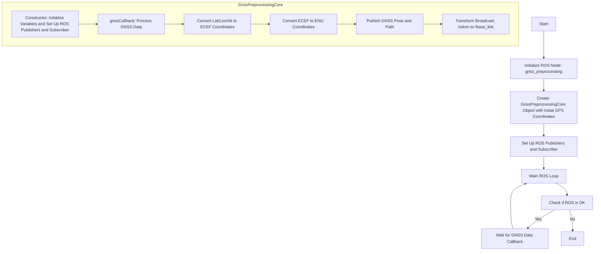
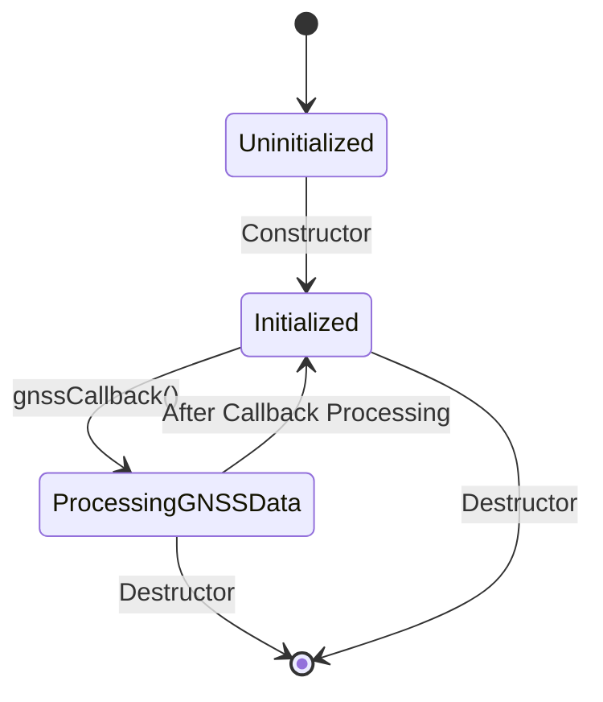

# gnss_preprocessing

## FlowChart



## State Transition Diagram



## 

```mermaid
sequenceDiagram
    participant Main
    participant ROS
    participant GnssPreprocessingCore
    participant ROS_NodeHandle
    participant ROS_Publisher
    participant ROS_Subscriber
    participant ROS_TF_Broadcaster
    participant Callback

    Main->>GnssPreprocessingCore: Instantiate with (lat0, lon0, hig0)
    activate GnssPreprocessingCore
    GnssPreprocessingCore->>ROS_NodeHandle: Create NodeHandle
    GnssPreprocessingCore->>ROS_Publisher: Advertise /gnss_pose and /gnss_path
    GnssPreprocessingCore->>ROS_Subscriber: Subscribe to /fix
    GnssPreprocessingCore->>ROS_TF_Broadcaster: Setup odom_to_baselink_broadcaster
    deactivate GnssPreprocessingCore

    loop ROS spin loop
        Main->>ROS: ros::spinOnce()
        ROS->>ROS_Subscriber: Check for new messages on /fix
        alt New message received
            ROS_Subscriber->>GnssPreprocessingCore: gnssCallback(new message)
            activate Callback
            Callback->>GnssPreprocessingCore: Process message
            GnssPreprocessingCore->>ROS_Publisher: Publish to /gnss_pose and /gnss_path
            GnssPreprocessingCore->>ROS_TF_Broadcaster: Send transform (odom_to_baselink_trans)
            deactivate Callback
        end
    end

    Main->>GnssPreprocessingCore: Destructor call
    deactivate GnssPreprocessingCore
```
