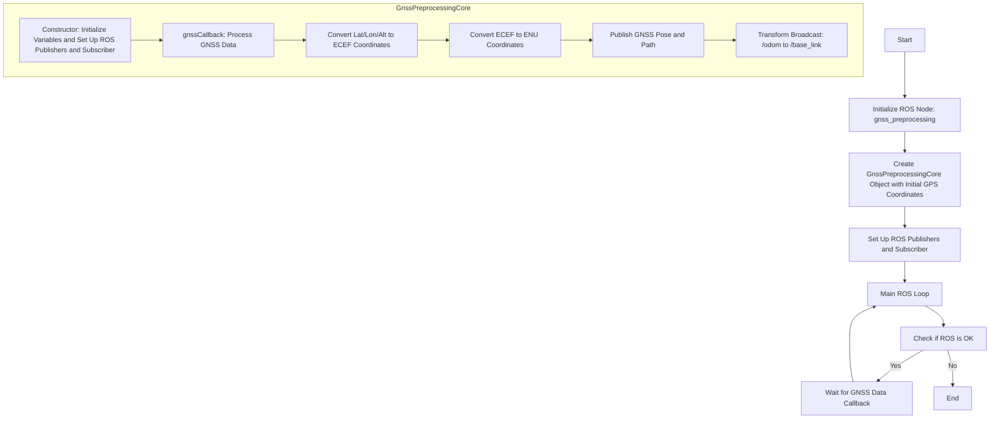
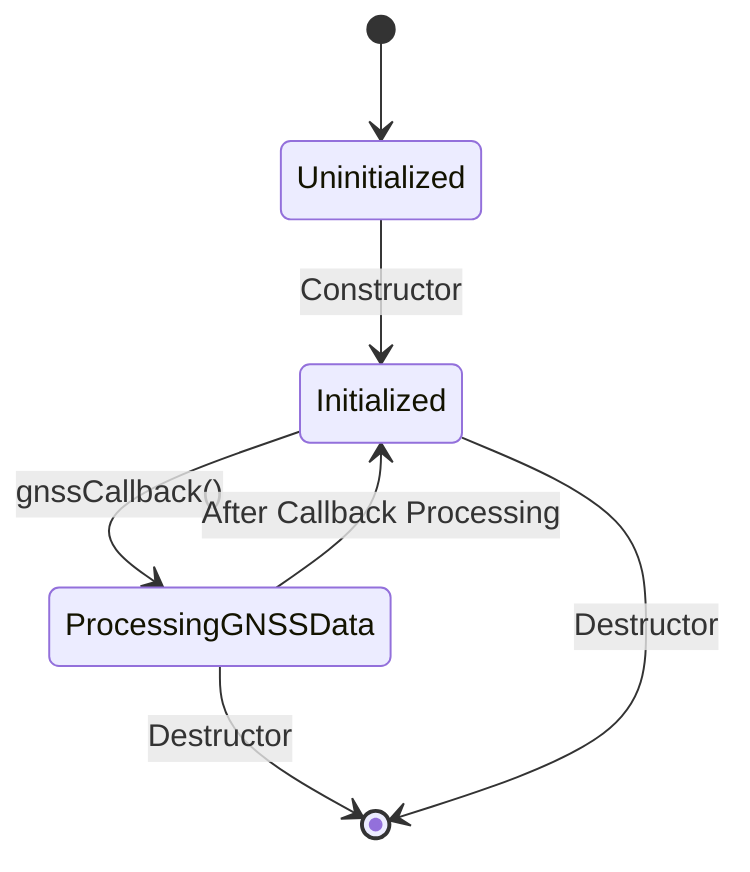

# gnss_preprocessing

## FlowChart

```mermaid
flowchart TD
    A[Start] --> B[Initialize ROS Node: gnss_preprocessing]
    B --> C[Create GnssPreprocessingCore Object with Initial GPS Coordinates]
    C --> D[Set Up ROS Publishers and Subscriber]
    D --> E[Main ROS Loop]
    E --> F[Check if ROS is OK]
    F -->|Yes| G[Wait for GNSS Data Callback]
    G --> E
    F -->|No| H[End]

    subgraph GnssPreprocessingCore
        I[Constructor: Initialize Variables and Set Up ROS Publishers and Subscriber]
        J[gnssCallback: Process GNSS Data]
        K[Convert Lat/Lon/Alt to ECEF Coordinates]
        L[Convert ECEF to ENU Coordinates]
        M[Publish GNSS Pose and Path]
        N[Transform Broadcast: /odom to /base_link]
    end

    I --> J
    J --> K
    K --> L
    L --> M
    M --> N

```

## State Transition Diagram

```mermaid
stateDiagram-v2
    [*] --> Uninitialized
    Uninitialized --> Initialized: Constructor
    Initialized --> ProcessingGNSSData: gnssCallback()
    ProcessingGNSSData --> Initialized: After Callback Processing
    ProcessingGNSSData --> [*]: Destructor
    Initialized --> [*]: Destructor
```
